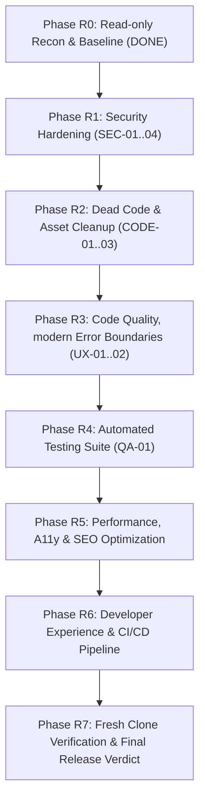

# MKAN CONCEPT — Comprehensive 360° Technical & Security Audit Report

> **Audit Branch**: `audit/full-review`  
> **Starting Backup Branch**: `backup/pre-audit`  
> **Date**: October 3, 2026  
> **Roles Active**: Senior Full-Stack Engineer, Security Engineer, QA Automation Engineer, Performance/A11y/SEO Specialist  
> **Audit Status**: **Phase R0 Completed (Read-Only Reconnaissance & Baseline)**

---

## 1. Executive Summary & Inventory Baseline

### 1.1 Architecture Overview
MKAN Concept is an ultra-luxury digital flagship and Studio Management CMS built with:
* **Framework**: Next.js 16.3.7 (App Router with Turbopack, React 19.2.8)
* **Styling**: Tailwind CSS v4 with custom luxury design tokens
* **Animations**: GSAP 3.15.0 + `@gsap/react` + Lenis Smooth Scroll (with strict `prefers-reduced-motion` compliance)
* **Database & CMS**: MongoDB Atlas via Mongoose 9.10.3 with connection pooling & zero-downtime static seed fallback
* **Authentication**: Custom zero-trust session management (bcrypt salt-12, SHA-256 hashed tokens, 7-day TTL, brute-force IP rate-limiting & account lockout)
* **Media Pipeline**: Sharp 0.35.5 (auto-orientation, Lanczos3 4K downscaling, WebP q90 compression, 16×16 blur placeholder) + Cloudflare R2 / Local Disk fallback
* **Email System**: Resend API SDK + fallback to MongoDB Studio Inbox

---

### 1.2 Route & Endpoint Inventory

| Path | Type | Auth Required | Purpose / Notes |
| :--- | :--- | :--- | :--- |
| `/` | Page (Static/ISR) | Public | Main single-page flagship website |
| `/privacy` | Page (Static) | Public | Privacy and personal data processing policy |
| `/sitemap.xml` | Route Handler | Public | Dynamic XML sitemap for search indexing |
| `/robots.txt` | Route Handler | Public | Crawler instructions and sitemap link |
| `/admin/login` | Page (Client) | Public (Rate-limited) | Studio management authentication portal |
| `/admin` | Page (Dynamic) | **Admin Session** | Unified Instagram-style Studio Management Console |
| `/admin/media` | Page (Dynamic) | **Admin Session** | Alias redirect to `/admin` |
| `/admin/messages` | Page (Dynamic) | **Admin Session** | Alias redirect to `/admin` |
| `/admin/method` | Page (Dynamic) | **Admin Session** | Alias redirect to `/admin` |
| `/admin/projects` | Page (Dynamic) | **Admin Session** | Alias redirect to `/admin` |
| `/admin/sections` | Page (Dynamic) | **Admin Session** | Alias redirect to `/admin` |
| `/admin/services` | Page (Dynamic) | **Admin Session** | Alias redirect to `/admin` |
| `/admin/settings` | Page (Dynamic) | **Admin Session** | Alias redirect to `/admin` |

---

### 1.3 Server Actions & Security Assertion Map

| Server Action | Target File | Authorization Guard | Input Sanitization & Validation |
| :--- | :--- | :--- | :--- |
| `submitContactInquiry` | `src/app/actions/contact.ts` | Public (Rate-Limited: 5/hr) | Honeypot trap, regex email, length bounds, HTML entity escaping |
| `loginAdminAction` | `src/app/actions/auth.ts` | Public (Rate-Limited: 10/15m) | Max byte length check, lockout, bcrypt compare |
| `logoutAdminAction` | `src/app/actions/auth.ts` | Cookie session | Token hash deletion in DB, cookie clear |
| `upsertProjectAction` | `src/app/actions/projects.ts` | **`requireAdmin()`** | Category enum, ObjectId check, URL scheme validator, slug sanitizer |
| `deleteProjectAction` | `src/app/actions/projects.ts` | **`requireAdmin()`** | ObjectId validation |
| `toggleProjectHomeAction`| `src/app/actions/projects.ts` | **`requireAdmin()`** | ObjectId validation, boolean assertion |
| `saveSectionDraftAction` | `src/app/actions/sections.ts` | **`requireAdmin()`** | Section key whitelist, 64KB JSON size cap |
| `publishSectionAction` | `src/app/actions/sections.ts` | **`requireAdmin()`** | Section key whitelist, instant ISR revalidation |
| `revertSectionAction` | `src/app/actions/sections.ts` | **`requireAdmin()`** | Section key whitelist, rollback buffer restore |
| `publishAllSectionsAction`| `src/app/actions/sections.ts` | **`requireAdmin()`** | Locale regex check, bulk update |
| `uploadMediaAction` | `src/app/actions/media.ts` | **`requireAdmin()`** | MIME type check, 4MB cap, Sharp buffer verification |
| `resetSlotToDefaultAction`| `src/app/actions/media.ts` | **`requireAdmin()`** | Slot key regex pattern |
| `updateMediaAltAction` | `src/app/actions/media.ts` | **`requireAdmin()`** | Alt text length cap (300 chars) |
| `toggleMessageReadAction`| `src/app/actions/messages.ts` | **`requireAdmin()`** | ObjectId check, enum status |
| `setMessageRepliedAction`| `src/app/actions/messages.ts` | **`requireAdmin()`** | ObjectId check, boolean assertion |
| `deleteMessageAction` | `src/app/actions/messages.ts` | **`requireAdmin()`** | ObjectId check |
| `exportMessagesCsvAction`| `src/app/actions/messages.ts` | **`requireAdmin()`** | Limit 5000 records, CSV quoting |

---

### 1.4 Baseline Verification Results

| Check | Command | Result | Notes |
| :--- | :--- | :--- | :--- |
| **TypeScript** | `npx tsc --noEmit` | ✅ **0 Errors** | Strict mode compliant |
| **Linting** | `npm run lint` | ✅ **0 Errors / 0 Warnings** | ESLint 9 + Next Core Web Vitals |
| **Production Build** | `npm run build` | ✅ **Compiled in 6.8s** | Turbopack static & dynamic routes generated |
| **Git Secret Audit** | `git log -S ...` | ✅ **0 Secrets in Git History** | Keys only existed in uncommitted local files |
| **Dependency Audit** | `npm audit` | ⚠️ **5 High Vulnerabilities** | `braces` via `@next/eslint-plugin-next` in devDependencies |
| **Automated Tests** | `npm test` | ⚠️ **0 Tests Configured** | Test harness (Vitest/Playwright) to be installed |

---

## 2. Findings Matrix

| ID | Severity | Area | File & Line | Evidence / Finding | Impact | Recommended Fix (Tier) | Status |
| :--- | :--- | :--- | :--- | :--- | :--- | :--- | :--- |
| **SEC-01** | **Medium** | Security | `src/app/actions/messages.ts:113` | CSV export does not escape leading spreadsheet formula operators (`=`, `+`, `-`, `@`, `\t`, `\r`) | Potential CSV / Formula Injection (CWE-1236) when opening inquiries in Excel | Sanitize leading formula characters by prefixing with `'` (Tier 1) | Identified |
| **SEC-02** | **Low** | Security / SEO | `src/app/robots.ts:8` | `robots.ts` has `allow: "/"` without explicit `disallow: ["/admin/", "/admin"]` | Web crawlers may attempt to crawl admin URLs | Add explicit disallow rules in `robots.ts` (Tier 1) | Identified |
| **SEC-03** | **Low** | Security | `src/proxy.ts:8` | Missing `Permissions-Policy` and Strict-Transport-Security (HSTS) headers | Security header score can be improved | Add comprehensive security headers in proxy/middleware (Tier 1) | Identified |
| **SEC-04** | **High** | Supply Chain | `package-lock.json` | 5 High vulnerabilities in `braces` transitive devDependency | Denial of Service risk in dev tooling | Update eslint and glob dependencies safely (Tier 1) | Identified |
| **CODE-01** | **Low** | Dead Code | `src/components/Section.tsx:1` | Unused component file not imported or rendered anywhere in the project | Dead code in repository | Remove unused component (Tier 1) | Identified |
| **CODE-02** | **Low** | DX / Git | `.gitignore:34` | `.env*` pattern unintentionally ignores `.env.example` unless negated | Developers cloning repo won't see `.env.example` in Git changes if edited | Add `!.env.example` to `.gitignore` (Tier 1) | Identified |
| **CODE-03** | **Low** | Dead Assets | `public/uploads/*.webp` | 14 test image uploads tracked in repository | Repository bloat (~5MB) | Clean up test uploads and add `public/uploads/*` to `.gitignore` with `.gitkeep` (Tier 1) | Identified |
| **UX-01** | **Medium** | Resiliency | `src/app/not-found.tsx` | Missing custom `not-found.tsx` page | Generic Next.js 404 page shown to visitors | Create custom luxury branded 404 error page (Tier 1) | Identified |
| **UX-02** | **Medium** | Resiliency | `src/app/error.tsx` | Missing `error.tsx` and `global-error.tsx` App Router error boundaries | Unhandled client/server errors display default unstyled screen | Add branded error boundaries with retry mechanisms (Tier 1) | Identified |
| **QA-01** | **High** | Quality Assurance | `package.json` | No automated test runner or test suites configured | Regressions cannot be caught in CI/CD pipeline | Add Vitest unit/integration test suite for Server Actions & critical flows (Tier 1) | Identified |

---

## 3. Prioritized Audit Plan (Phases R1 - R7)

---

## 4. Questions & Tier 2 Approvals Required

1. **Automated Test Framework**:
   * *Recommendation*: Install **Vitest** for fast unit/integration testing of Server Actions, Auth lockout, and Validation, plus **Playwright** for end-to-end browser testing.
   * *Approval Requested*: May we proceed with adding Vitest & Playwright devDependencies?

2. **Admin Subpages Structure**:
   * Currently, `/admin/media`, `/admin/messages`, etc., immediately redirect to `/admin` because the studio is a unified single-view application. Is it preferred to keep these redirects for backwards compatibility, or keep them as-is?

3. **Public Uploads Cleanup**:
   * May we delete the 14 temporary test images currently in `public/uploads/` and add `public/uploads/*` to `.gitignore` so local test uploads don't clutter the git repository?
